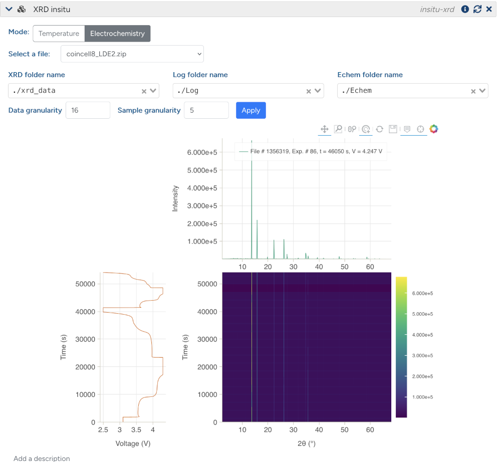

# <div align="center"><i>datalab *in situ* plugin</i></div>

<div align="center" style="padding-bottom: 5px">
<a href="https://demo.datalab-org.io"></a>
</div>
<div align="center">
<a href="https://github.com/datalab-org/datalab-app-plugin-insitu/releases"></a>
<a href="https://github.com/datalab-org/datalab-app-plugin-insitu"></a>
</div>
<div align="center">
<a href="https://datalab-app-plugin-insitu.readthedocs.io/en/latest/?badge=latest"></a>
</div>
<div align="center">
<a href="https://join.slack.com/t/datalab-world/shared_invite/zt-2h58ev3pc-VV496~5je~QoT2TgFIwn4g"></a>
</div>


A Python plugin for processing and visualizing *in situ* (NMR, UV-Vis, XRD) data within [_datalab_](https://github.com/datalab-org/datalab) instances.

The project was originally developed in the [Grey Group](https://www.ch.cam.ac.uk/group/grey/) in the Department of Chemistry at the University of Cambridge, with support and ongoing maintenance from [*datalab industries ltd.*](https://datalab.industries).

## Features

- Support for NMR, XRD and UV-Vis data, recorded alongside electrochemical experiments, temperature ramps or other time series data (support varies across data types)
- Integration with electrochemical data formats for combined analysis using [navani](https://github.com/be-smith/navani)
- Interactive visualization using Bokeh, with heatmaps and spectra selection
- Support for both local files, as well as running as a plugin directly on a *datalab* instance

<div align="center">
   
</div>

## Roadmap

There are still several planned features and improvements for this plugin,
including:

- Supporting all formats for electrochemistry, NMR, XRD and UV-Vis that are supported by the corresponding non-*in situ* blocks available in *datalab*.
- More flexible specification of other time series data across all data types, e.g., temperature or pressure ramps.
- Improved performance and caching of data, especially for large datasets.

# Installation

The `datalab-app-plugin-insitu` package is currently a "core plugin" of *datalab* (since *datalab* v0.5.3), i.e., it will be installed on *datalab* instances by default.

## Development installation

We recommend you use [`uv`](https://astral.sh/uv) for managing virtual environments and Python versions.

Once you have `uv` installed, you can clone this repository and install the package in a fresh virtual environment with:

```shell
git clone git@github.com:datalab-org/datalab-app-plugin-insitu
cd datalab-app-plugin-insitu
uv sync --all-extras --dev
```

You can activate `pre-commit` in your cloned repository with `uv run pre-commit install`.

You can run the tests using `pytest`, optionaly with the marker `show_plots` to display the plots generated by the tests:

```shell
uv run pytest -m show_plots
```

## Usage

Full reference API documentation can be found on [ReadTheDocs](https://datalab-app-plugin-insitu.readthedocs.io/).

### Data Structure Requirements


#### NMR

Your *in situ* NMR data should be organized as follows:

```
data_folder.zip/
├── <nmr_folder>/
│   ├── 1/
│   │   ├── acqus
│   │   └── pdata/
│   │       └── 1/
│   │           └── ascii-spec.txt
│   ├── 2/
│   │   └── ...
│   └── ...
└── <echem_folder>/
    └── *.MPR
```

with the `<nmr_folder>` and `<echem_folder>` names specified at runtime (or via the *datalab* UI).

#### UV-Vis

```
data_folder.zip/
├── <uv-vis folder>/
│   ├── scan_0000.txt
│   ├── scan_0001.txt
│   ├── scan_0002.txt
│   ├── scan_0003.txt
│   ├── scan_0004.txt
│   ├── scan_0005.txt
│   ├── ...
│   └── scan_<N>.txt
├── <uv-vis reference folder>/
│   └── reference.txt
└── <echem_folder>/
    ├── <echem_file_1>
    ├── <echem_file_2>
    └── ...
```

where the `<uv-vis folder>` contains the UV-Vis scans (named as `*_<n>.txt`, which will be used for sorting), the `<uv-vis reference folder>` contains the reference spectrum, and the `<echem_folder>` contains one or more electrochemical data files loadable by [navani](https://github.com/be-smith/navani). Note if multiple files are present then navani will attempt to stitch them together, so do not upload duplicates (e.g processed and unprocessed versions of the same file).

#### XRD

There are two XRD plotting modes, against Temperature and against Electrochemistry, both pathways require a folder containing the xrd data and the log data as shown below, with the electrochemistry pathway requiring a third directory for the electrochemistry data.

```
data_folder.zip/
├── <xrd folder>/
│   ├── 0000-scan.dat
│   ├── 0001-scan.dat
│   ├── 0002-scan.dat
│   ├── 0003-scan.dat
│   ├── 0004-scan.dat
│   ├── 0005-scan.dat
│   ├── ...
│   └── <N>-scan.dat
└── <log folder>/
    └── time_series_log.csv
└── <echem folder>/ (optional)
    ├── <echem_file_1>
    ├── <echem_file_2>
    └── ...

```

where the `<xrd folder>` contains the XRD scans (named as `0000-scan.dat`, `0001-scan.dat`, etc.), and the `<log folder>` contains a time series log file in CSV format, mapping scan number to the time series data, e.g. for the Temperature mode:

```csv
scan_number,Temp
0000, 25.0
0001, 30.0
0002, 35.0
0003, 40.0
```

And for the electrochemistry mode:

```csv
scan_number,start_time,end_time
0000, 25.0, 2025-07-02 19:05:59.614000, 2025-07-02 19:06:56.167000
0001, 30.0, 2025-07-02 19:15:03.582000, 2025-07-02 19:15:59.280000
0002, 35.0, 2025-07-02 19:24:07.586000, 2025-07-02 19:25:04.074000
0003, 40.0, 2025-07-02 19:33:12.198000, 2025-07-02 19:34:08.917000
```

The `<echem folder>` contains one or more electrochemistry files readable by [navani](https://github.com/be-smith/navani), Note if multiple files are present then navani will attempt to stitch them together, so do not upload duplicates (e.g processed and unprocessed versions of the same file). For the XRD usecase it's currently expected that the echem file has a `Timestamp` column containing date-time information for matching to the log file (e.g Neware files).

## License

This project is released under the conditions of the MIT license. Please see [LICENSE](https://github.com/datalab-org/datalab-app-plugin-insitu/blob/main/LICENSE) for the full text of the license.

## Contact

For questions and support, please [open an issue](https://github.com/datalab-org/datalab-app-plugin-insitu/issues) on the GitHub repository or join the [public datalab Slack workspace](https://join.slack.com/t/datalab-world/shared_invite/zt-2h58ev3pc-VV496~5je~QoT2TgFIwn4g).
